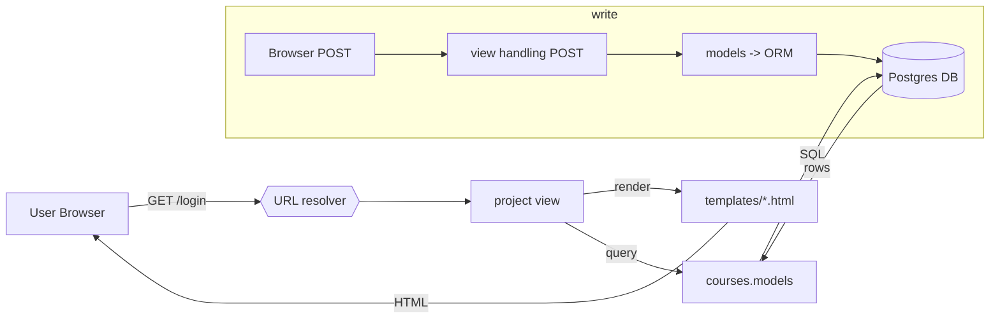

## Data flow — course_registration (textual + mermaid)

User request lifecycle (high level)

1. Browser -> HTTP request to server (e.g. /login/, /dashbord/)
2. Django URL resolver: `course_registration/urls.py` matches path -> calls view function in `course_registration/views.py`.
3. View logic (currently minimal) usually calls `render(request, '<template>.html')` to produce HTML.
4. If the page needs data persistence, the view would query models in `courses/models.py` which map to the Postgres database configured in `course_registration/settings.py`.
5. Django templates render the HTML and the response is returned to the browser.

Data-write lifecycle (e.g., creating a Course)

- POST from browser -> URL -> view
- view validates request (forms/serializers), creates or updates model instances in `courses/models.py` -> ORM issues SQL to Postgres -> DB persists rows
- on success, redirect or render template with updated state

Mermaid flowchart (if your editor/MD renderer supports it)

ASCII fallback

Browser -> URL resolver -> view -> (template OR models -> DB) -> response -> Browser

Notes
- Currently most views are read-only template renders; adding domain logic will add ORM calls into the flow.
- DB is Postgres configured in `settings.py`. For lightweight dev/testing you can switch to SQLite in a local settings override.
